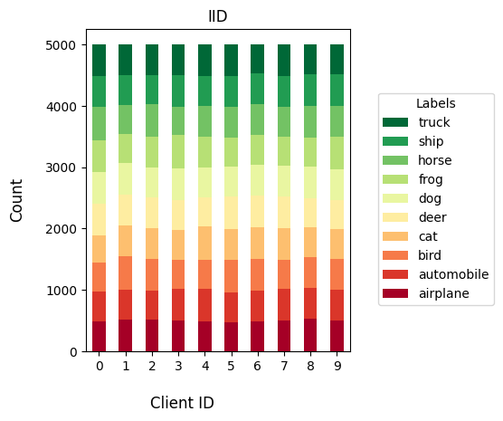
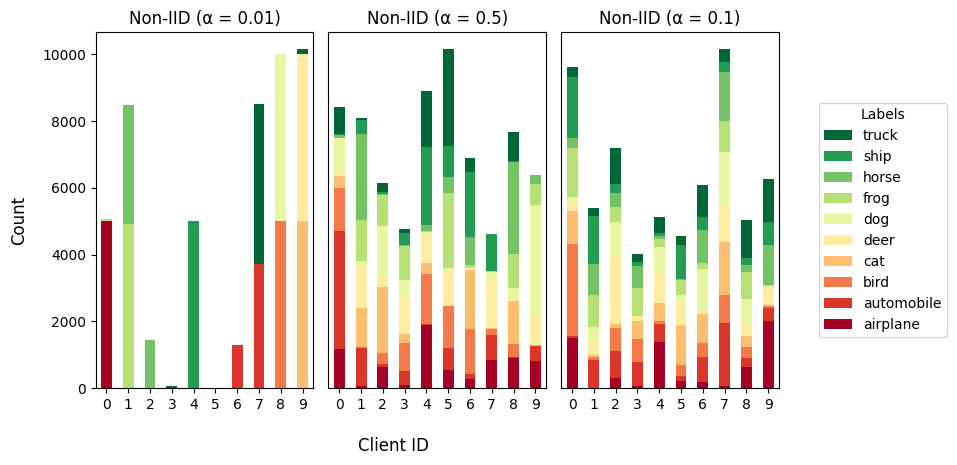

## Data Distributions:
### 1. iid
If the data distribution used is `iid` the data will be equally partitioned among all clients i.e every client will recieve data from all the classes of the selected dataset.

***

### 2. dirichlet_niid
This is a relatively new approach to generate non-iid data based on the dirichlet distribution process. Some more details regarding this process can be obtained from here [Link](https://arxiv.org/abs/1909.06335) .

If data distribution type is `dirichlet_niid`, the data partitions will be generated based on value of `dirichlet_alpha` value.

> **Note**: More data distribution approaches will be added soon.