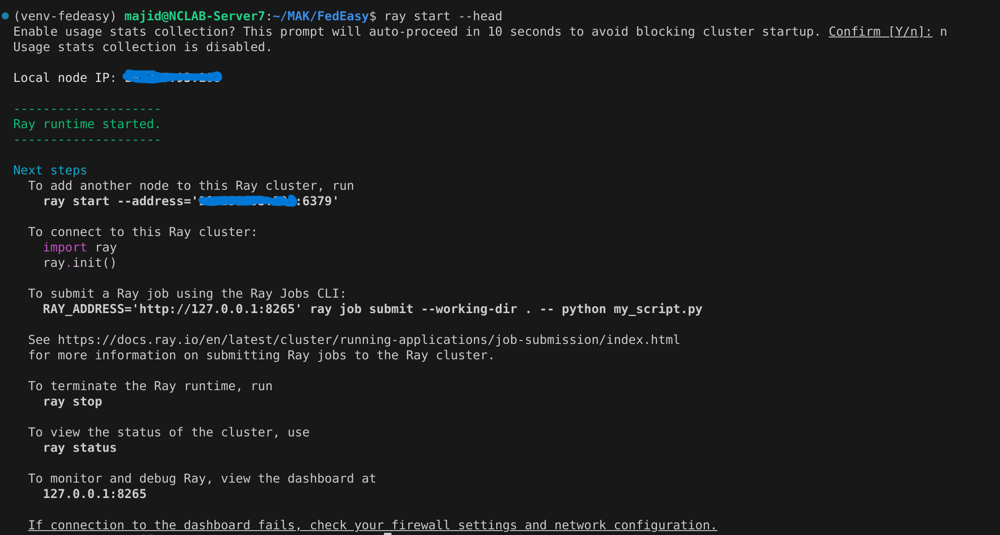
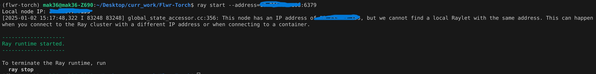
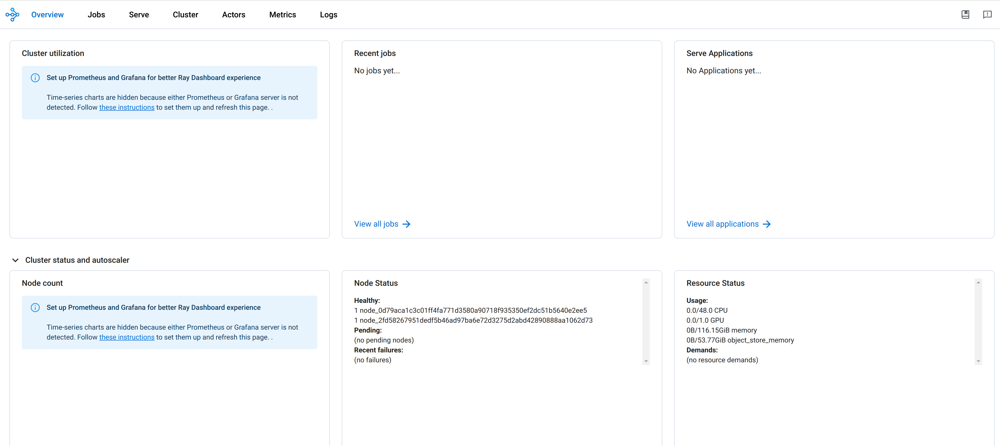
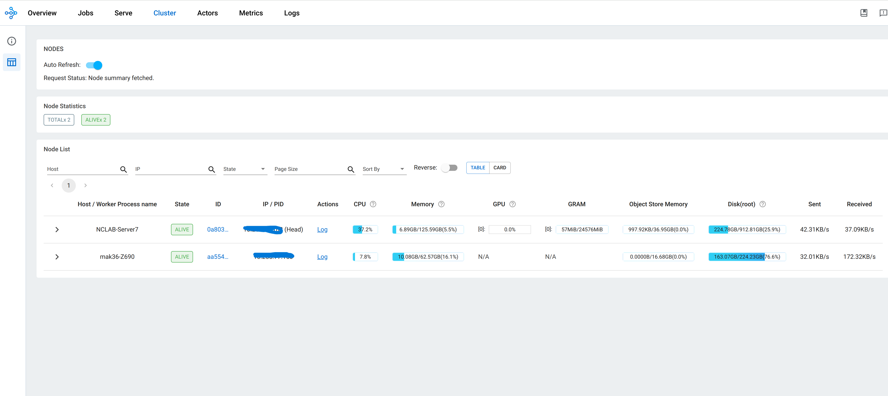

# A Short Tutorial on Using Multi-Node Simulations with FedEasy

This tutorial guides you through running multi-node simulations with **FedEasy**. If you haven't installed FedEasy, please refer to the [official documentation](https://fedeasy.readthedocs.io) or the project's README for installation and setup instructions.

---

## 📜 Prerequisites

Before proceeding, ensure the following:

- Access to at least two servers/PCs.
- **FedEasy** installed and set up on all machines. If not installed, follow the steps in the [Documentation](https://fedeasy.readthedocs.io).

---

## 🚀 Getting Started

Follow these steps to run a multi-node example:

### Step 1: Set Up the Head Node

1. **Activate the virtual environment** on the designated head node by running:
```bash
   conda activate venv-fedeasy
```
> _Note_: Replace `venv-fedeasy` with the name of your virtual environment, if different.

2. **Start the Ray cluster** on the head node:
```bash
   ray start --head
```
The `--head` flag designates this node as the cluster head.

3. After execution, you'll see connection details like the **IP:PORT** of the head node. These details will be used to connect other nodes to this cluster:



4. (Optional) You can configure the CPU and GPU resources for the head node as follows:
```bash
   ray start --head --num_cpus 16 --num_gpus 1
```
By default, Ray uses all available resources. Refer to the [Ray Documentation](https://docs.ray.io/en/latest/ray-core/configure.html) for more details.

5. Verify the Ray dashboard at [http://127.0.0.1:8265](http://127.0.0.1:8265).

---

### Step 2: Connect Worker Nodes

1. On each worker node (the machines you want to connect to the head node), activate the virtual environment:
```bash
   conda activate venv-fedeasy
```

2. Connect to the cluster by specifying the head node's address:
```bash
   ray start --address <head-ip>:6379
```
Replace `<head-ip>` with the IP address provided during the head node's initialization.



3. (Optional) Configure resources for worker nodes:
```bash
   ray start --address <head-ip>:6379 --num_cpus 16 --num_gpus 1
```
Here, the worker node will use 16 CPUs and 1 GPU (if available).

4. Verify the total resources in the cluster by visiting the Ray dashboard at [http://127.0.0.1:8265/#/overview](http://127.0.0.1:8265/#/overview).



5. Click the cluster menu in the dashboard to see all connected nodes:



---

### Step 3: Enable Multi-Node Mode in Configuration

On all nodes, including the head node, update the `config.yaml` file by setting the `multi_node` variable to `True` under the `common` block.

---

### Step 4: Run a Training Example

Finally, to train a model in the multi-node environment, execute the following script on the **head node**:
```bash
   ./examples/multi-node-simulations/run_cifar10_multi_node.sh
```
FedEasy will handle the rest of the process automatically.

---

## 🌟 Additional Tips

- Ensure all nodes have synchronized system clocks to avoid issues in communication or logging.
- For troubleshooting, consult the [FedEasy Documentation](https://fedeasy.readthedocs.io) or the [Ray Troubleshooting Guide](https://docs.ray.io/en/latest/troubleshooting.html).

